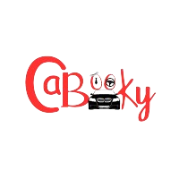

<div align="center">
  
  <h2><b> CaBooky </b></h2>
</div>

<a name="readme-top"></a>

<!-- TABLE OF CONTENTS -->

# 📗 Table of Contents
- [📖 About the Project](#about-project)
  - [🛠 Built With](#built-with)
    - [Tech Stack](#tech-stack)
    - [Key Features](#key-features)
  - [📜 Kanban Board](#kanban-board)
  - [🎥 Rails Backend](#rails-backend)
  - [🎞️ CaBooky Preview](#cabooky-preview)
  - [🚀 Live Demo](#live-demo)
- [💻 Getting Started with Create React App](#getting-started-with-create-react-app)
- [💻 Getting Started](#getting-started)
  - [Setup](#setup)
  - [Prerequisites](#prerequisites)
  - [Usage](#usage)
  - [Run Tests](#run-tests)
  - [Deployment](#deployment)
- [👥 Authors](#authors)
- [🔭 Future Features](#future-features)
- [🤝 Contributing](#contributing)
- [⭐️ Show your support](#support)
- [🙏 Acknowledgements](#acknowledgements)
- [📝 License](#license)

<!-- PROJECT DESCRIPTION -->

# 📖 CaBooky <a name="about-project"></a>

**CaBooky** is Car booking service. This application allows the users to subscribe(sign up) to the app so that the user can add new cars and be able to reserve the cars basing on the date and city. This app uses the external RESTful api endpoints for data accessing.

## 🛠 Built With <a name="built-with"></a>

### Tech Stack <a name="tech-stack"></a>

<details>
  <summary>Client</summary>
  <ul>
    <li><a href="https://react.dev/">React</a></li>
    <li><a href="https://www.w3schools.com/html/">HTML</a></li>
    <li><a href="https://www.w3schools.com/css/default.asp">CSS</a></li>
    <li><a href="https://developer.mozilla.org/en-US/docs/Web/JavaScript">JavaScript</a></li>
  </ul>
</details>

<!-- Features -->

### Key Features <a name="key-features"></a>

- **A user can add new items (cars)**

- **Current user can reserve the item basing the date and city.**

- **Uses React Redux middleware for async functions API interactions**

- **The application has CRUD operations.**

<p align="right">(<a href="#readme-top">back to top</a>)</p>

<!-- KANBAN BOARD -->

## Kanban Board
<a name="kanban-board"></a>

We are a Team of Four, so we used the custom Kanban board to divide tasks and keep track of progress.

- [Kanban Board Initial version](https://github.com/tan12082001/Vehical-Appointment-App-Backend/assets/81354942/f57bf009-046a-4c8a-817d-5b3cb163421c)
- [Kanban Board Final Version]()

<p align="right">(<a href="#readme-top">back to top</a>)</p>

<!-- RAILS BACKEND -->

## Supporting Backend Project
<a name="rails-backend"></a>

- [Vehicle-Booking-App-Backend](https://github.com/tan12082001/hello-rails-back-end)

<p align="right">(<a href="#readme-top">back to top</a>)</p>

<!-- APPLICATION PREVIEW -->

## CaBooky Preview
<a name="cabooky-preview"></a>

<p align="right">(<a href="#readme-top">back to top</a>)</p>

<!-- LIVE DEMO -->

## 🚀 Live Demo

 <a name="live-demo"></a>

- [CaBooky Application ]()

<p align="right">(<a href="#readme-top">back to top</a>)</p>

<!-- Getting started with Create-react-app -->

## Getting Started with Create React App <a name="getting-started-with-create-react-app"></a>

This project was bootstrapped with [Create React App](https://github.com/facebook/create-react-app).

<details>
  <summary>More Information</summary>
  
  ### Available Scripts

  In the project directory, you can run:

  ### `npm start`

  Runs the app in the development mode.\
  Open [http://localhost:3000](http://localhost:3000) to view it in your browser.

  The page will reload when you make changes.\
  You may also see any lint errors in the console.

  ### `npm test`

  Launches the test runner in the interactive watch mode.\
  See the section about [running tests](https://facebook.github.io/create-react-app/docs/running-tests) for more information.

  ### `npm run build`

  Builds the app for production to the `build` folder.\
  It correctly bundles React in production mode and optimizes the build for the best performance.

  The build is minified and the filenames include the hashes.\
  Your app is ready to be deployed!

  See the section about [deployment](https://facebook.github.io/create-react-app/docs/deployment) for more information.

  ### `npm run eject`

  **Note: this is a one-way operation. Once you `eject`, you can't go back!**

  If you aren't satisfied with the build tool and configuration choices, you can `eject` at any time. This command will remove the single build dependency from your project.

  Instead, it will copy all the configuration files and the transitive dependencies (webpack, Babel, ESLint, etc) right into your project so you have full control over them. All of the commands except `eject` will still work, but they will point to the copied scripts so you can tweak them. At this point you're on your own.

  You don't have to ever use `eject`. The curated feature set is suitable for small and middle deployments, and you shouldn't feel obligated to use this feature. However we understand that this tool wouldn't be useful if you couldn't customize it when you are ready for it.

  ## Learn More

  You can learn more in the [Create React App documentation](https://facebook.github.io/create-react-app/docs/getting-started).

  To learn React, check out the [React documentation](https://reactjs.org/).

  ### Code Splitting

  This section has moved here: [https://facebook.github.io/create-react-app/docs/code-splitting](https://facebook.github.io/create-react-app/docs/code-splitting)

  ### Analyzing the Bundle Size

  This section has moved here: [https://facebook.github.io/create-react-app/docs/analyzing-the-bundle-size](https://facebook.github.io/create-react-app/docs/analyzing-the-bundle-size)

  ### Making a Progressive Web App

  This section has moved here: [https://facebook.github.io/create-react-app/docs/making-a-progressive-web-app](https://facebook.github.io/create-react-app/docs/making-a-progressive-web-app)

  ### Advanced Configuration

  This section has moved here: [https://facebook.github.io/create-react-app/docs/advanced-configuration](https://facebook.github.io/create-react-app/docs/advanced-configuration)

  ### Deployment

  This section has moved here: [https://facebook.github.io/create-react-app/docs/deployment](https://facebook.github.io/create-react-app/docs/deployment)

  ### `npm run build` fails to minify

  This section has moved here: [https://facebook.github.io/create-react-app/docs/troubleshooting#npm-run-build-fails-to-minify](https://facebook.github.io/create-react-app/docs/troubleshooting#npm-run-build-fails-to-minify)

</details>


<p align="right">(<a href="#readme-top">back to top</a>)</p>

<!-- GETTING STARTED -->

## 💻 Getting Started <a name="getting-started"></a>

To get a local copy up and running, follow these steps.

### Prerequisites

In order to run this project you need:

- [Node.js and npm](https://nodejs.org/)

### Setup

Clone this repository to your desired folder:

```sh
  cd my-folder

  git clone git@github.com:tan12082001/Vehicle-Booking-App-Frontend.git

  npm install
```

### Usage

To run the project, if you are using a Code Editor make use of a live server.
If you are working with webpack you can run the local host with the following command.

```sh
  npm start
```

### Run Tests

To run the test suits:

```sh
  npm test
```

### Deployment

You can deploy this project using:

```sh
  gh-pages
```
This Project is deployed using [Render](https://render.com/)

<p align="right">(<a href="#readme-top">back to top</a>)</p>

<!-- AUTHORS -->

## 👥 Authors <a name="authors"></a>

👤 **Toyyib Bello Omobolaji**

- GitHub: [@githubhandle](https://github.com/Simpleshaikh1)
- LinkedIn: [LinkedIn](https://www.linkedin.com/in/toyyib-abayomi/)

👤 **Nweneary Uzochukwu Winnie**

- GitHub: [@githubhandle](https://github.com/wineshuga)
- LinkedIn: [LinkedIn](https://www.linkedin.com/in/wineshuga/)

👤 **Suleiman Gacheru**

- GitHub: [@hetrox8](https://github.com/hetrox8)
- Twitter: [@suleimangacheru](https://twitter.com/SuleimanGacheru)

👤 **Tanmayi Manku**

- GitHub: [@tan12082001](https://github.com/tan12082001)
- LinkedIn: [LinkedIn](https://www.linkedin.com/in/tanmayi-manku-99195720a/)

<p align="right">(<a href="#readme-top">back to top</a>)</p>

<!-- FUTURE FEATURES -->

## 🔭 Future Features <a name="future-features"></a>

- [ ] **Apply admin authorization, and restrict the Create new car, delete a car actions unless admin.**

- [ ] **Add the Delete or Cancel Reservation Feature.**

- [ ] **Add cars data from Admin and update landing page.**

- [ ] **Update the image uploading in the `Add new Car` so the items renders uploaded image.**

<p align="right">(<a href="#readme-top">back to top</a>)</p>

<!-- CONTRIBUTING -->

## 🤝 Contributing <a name="contributing"></a>

Contributions, issues, and feature requests are welcome!
Feel free to check the GitHub page.

<p align="right">(<a href="#readme-top">back to top</a>)</p>

<!-- SUPPORT -->

## ⭐️ Show your support <a name="support"></a>

If you like this project give it a star.
<p align="right">(<a href="#readme-top">back to top</a>)</p>

<!-- ACKNOWLEDGEMENTS -->

## 🙏 Acknowledgments <a name="acknowledgements"></a>

We would like to thank Microverse for providing the required lessons and tutorials for successfully completing the project.

We would like to thank [Murat Korkmaz](https://www.behance.net/muratk) for the original Wireframe design of the application [Vespa-Responsive-design](https://www.behance.net/gallery/26425031/Vespa-Responsive-Redesign).

<p align="right">(<a href="#readme-top">back to top</a>)</p>

<!-- LICENSE -->

## 📝 License <a name="license"></a>

This project is [MIT](./LICENSE) licensed.

<p align="right">(<a href="#readme-top">back to top</a>)</p>
